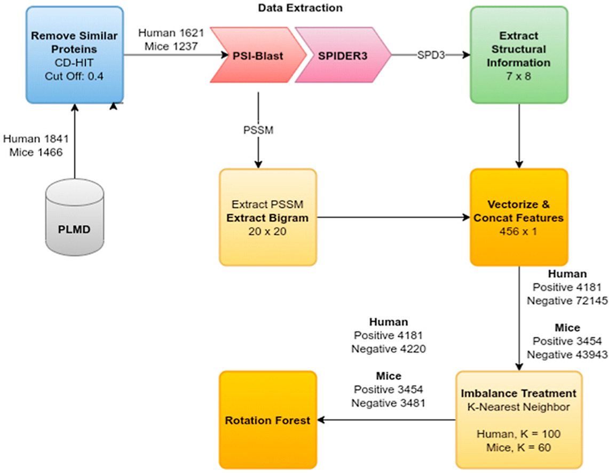

## Official Implementation of [SEMal: Accurate Protein Malonylation Site Predictor Using Structural and Evolutionary Information](https://www.sciencedirect.com/science/article/abs/pii/S001048252030353X)

Predict Malonylation Sites from a protein sequence using both structural and evolutionary information

## Flowchart

## STEPS:  
    1. elm to .csv convert:
        Run "1_elm_to_csv" with proper function parameters (input is the .elm file downloaded from "http://plmd.biocuckoo.org/download.php"

    2. .csv to mathematical sequence:
        Run "2_mathematical_seq" with proper function parameters (input is the output from previous step)
        0 = Non_sites
        1 = Sites
        2 = Others

    3. Get proteins in fasta format:
        Run "3_fasta.py" with proper function parameters (input is the output from previous step)

    4. CD_HIT to eliminate identical proteins:
        Run CDHIT (http://weizhong-lab.ucsd.edu/cdhit_suite/cgi-bin/index.cgi?cmd=cd-hit)

    5. Get Unique fastas in different files:
        Run "4_unique_seq_different_file" to get the fastas in different files for getting PSSM

    6. Get PSSM
        Run PSSM on the cloud using the scripts.sh folder commands

    7. Get SPD3
        Run SpiderLocal to get the SPD3 files

    8. Get Statistics
        Run "5_how_many_sites.py" to get number of sites and non-sites
